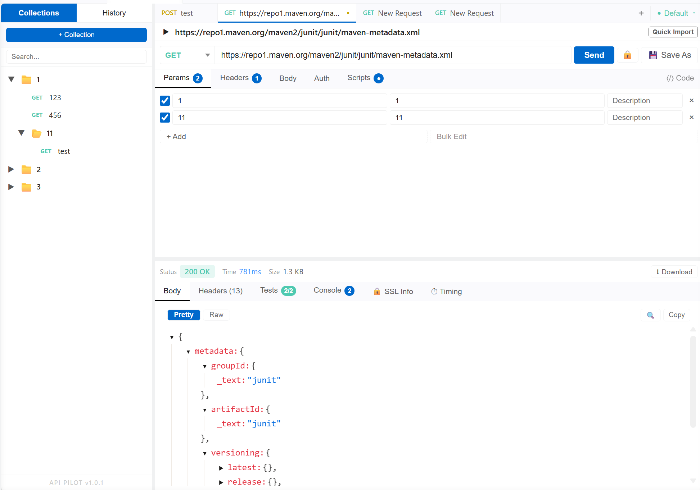

# API Pilot

[中文文档](README_zh.md)

**A powerful API debugging tool built right into VS Code — no browser, no separate app.**


---



---

## Features

### HTTP Request

- **Methods**: GET, POST, PUT, DELETE, PATCH, OPTIONS, HEAD
- **Custom Methods**: Add additional HTTP methods (e.g. `PROPFIND`, `MKCOL`) via the `api-pilot.customHttpMethods` VS Code setting — they appear in the method dropdown alongside the standard methods
- **Custom Headers**: Add any request header as key-value pairs; toggle individual headers on/off without deleting them
- **Query Parameters**: Dedicated key-value editor for URL query params with per-row enable/disable toggles
- **Request Body**: Supports multiple body types:
  - **JSON** — syntax-highlighted editor
  - **Form Data** (multipart) — key-value fields with file upload support
  - **URL Encoded** (x-www-form-urlencoded)
  - **Raw** — free text with custom Content-Type
  - **Binary** — upload a local file as body
  - **GraphQL** — query + variables editor
- **Authentication**: Bearer Token, Basic Auth, API Key (header or query param)
- **SSL Verification**: Toggle SSL certificate verification per request
- **Scripts**: Write JavaScript pre-request and post-response scripts using a Postman-compatible `pm` API — modify the request, set variables, or assert response values

### WebSocket (WS) Request

- The extension detects `ws://` and `wss://` URLs and switches the request UI into WebSocket mode.
- Connect / Disconnect: enter a WebSocket URL in the request bar and click **Connect** to open a live session; click **Disconnect** to close it.
- Conversation panel: send and receive messages (text shown as UTF‑8, binary shown as base64), with per-message copy and truncate/expand controls.
### Server-Sent Events (SSE)

- Select **SSE** from the protocol dropdown in the URL bar to switch into SSE mode.
- **Connect / Disconnect**: enter an SSE endpoint URL and click **Connect**; click **Disconnect** to close the stream.
- **Event stream panel**: real-time list of received SSE events showing timestamp, event type (if non-default), event ID, and data content with copy and expand controls.
- Supports the full SSE spec: `id:`, `event:`, `data:`, and `retry:` fields; multi-line data blocks are joined with `\n`.
- Custom **Headers**, **Params**, and **Auth** are all supported (Body and Scripts tabs are hidden in SSE mode).
- Sessions are automatically saved to **Request History** with the event count and duration on disconnect.

### MQTT

- Select **MQTT** from the protocol dropdown in the URL bar to switch into MQTT mode.
- **Connect / Disconnect**: enter a broker URL (e.g. `mqtt://localhost:1883` or `mqtts://`) and click **Connect**; click **Disconnect** to close the session.
- **Connection Options** tab: configure Client ID, Keep Alive, Clean Session, Username/Password, and Last Will (topic, payload, QoS, Retain).
- **Subscriptions**: add topic filters (wildcards `+` and `#` supported) with per-subscription QoS; active subscriptions shown as removable badges.
- **Message log**: real-time scrolling list of published (↑) and received (↓) messages, each showing topic, QoS, retain flag, timestamp, payload size, and a copy button. Long payloads can be expanded.
- **Publish panel**: compose and send messages with topic, payload, QoS (0/1/2), and Retain controls; `Ctrl+Enter` sends.
- Sessions are automatically saved to **Request History** with publish/receive counts, subscribed topics, and duration on disconnect.

### gRPC

- Select **gRPC** from the protocol dropdown in the URL bar to switch into gRPC mode.
- **Service Discovery**: use **Server Reflection** (auto-discover services from the server, no proto file needed) or **Upload .proto** to load a proto definition manually.
- **Service & Method selector**: once services are discovered, pick the service and method from dropdowns in the **Options** tab.
- **All call types supported**: Unary, Server Streaming, Client Streaming, and Bidirectional Streaming.
- **Message panel**: shows all sent (↑ REQ) and received (↓ RES) messages in a scrolling log; click any message to expand its JSON payload.
- **Client / Bidi streaming**: after invoking, a **Send** panel appears at the bottom to send additional messages; `Ctrl+Enter` sends. An **End Stream** button closes the write side.
- **TLS / Security**: supports Plaintext, TLS (CA certificate), and mTLS (client certificate + key).
- **Metadata**: key-value pairs sent as gRPC headers with per-row enable/disable.
- URL format: `grpc://host:port` (plaintext) or `grpcs://host:port` (TLS), or bare `host:port`.
- Sessions are automatically saved to **Request History** with method name and gRPC status code.

### Response Viewer

- **Status & Timing**: HTTP status code, status text, response time (ms), and body size — each labeled for clarity
- **Timing Breakdown**: Dedicated **Timing** tab shows a horizontal bar chart with three phases:
  - **DNS + Connect** — DNS resolution + TCP/TLS handshake time
  - **Wait (TTFB)** — server processing time until first byte received
  - **Download** — response body download time
  - Each phase displays milliseconds and percentage of total time
- **Body Rendering**:
  - JSON — pretty-printed with collapsible tree
  - XML, Markdown, HTML — rendered view
  - Images — inline preview
  - Raw text — plain output
- **Response Headers**: Full header list in a dedicated tab
- **Body Search**: Search within the response body
- **SSL Info**: For HTTPS requests — shows protocol (TLS version), cipher suite, certificate subject/issuer, validity dates, fingerprint, and full certificate chain
- **Test Results**: Pass/fail results from `pm.test()` assertions in the post-response script — shows test name, status (pass/fail), and error message on failure
- **Script Console**: Captured `console.log / warn / error` output from pre/post scripts, with source (pre/post) and log level indicated

### Collections

- Organize requests into collections with **nested folders**
- Full CRUD: create, rename, delete collections and folders
- Save the current request directly into any collection
- **Search / Filter**: Real-time search box filters requests by name or URL across all collections and folders; matching sections auto-expand

### Environment Variables

- Create multiple environments (e.g. dev, staging, prod) with key-value variable sets
- Use `{{variable_name}}` anywhere: URL, headers, params, body, auth fields
- Variables are resolved recursively (up to 5 levels) at send time and during cURL/code export
- Switch the active environment from the status bar; active environment persists across restarts
- A `Default` environment is always guaranteed to exist

### Request History

- Every sent request is automatically recorded, grouped by date (up to 1000 entries total), with one-click replay
- **Search / Filter**: Real-time search box filters history entries by URL, method, or request name; matching date groups auto-expand

### Response Comparison

- **Right-click any HTTP tab** and choose **⇄ Compare with...** to open the comparison panel
- **Select a tab for each side** from dropdowns — only tabs with a recorded response are listed
- Four sub-panels cover every angle of the diff:
  - **Summary** — status code, response time, and body size side-by-side; rows with differences are highlighted
  - **Body** — line-level LCS diff with JSON auto-formatted before comparison; added lines in green (+), removed in red (−), with a +N/−N count shown at the top
  - **Headers** — union table of all response header keys; rows where the values differ or a header is missing on one side are highlighted
  - **Request** — Method + URL, query params, and request headers compared in separate tables; differing rows highlighted
- Press `Esc` or click the backdrop to close

### cURL / Fetch Import & Export

- Paste a **cURL** command (bash) or a **fetch()** snippet (Chrome DevTools / Node.js) to instantly import it as a request
- Export any request to cURL — environment variables are resolved in the output

### Code Snippets

- Generate ready-to-use code snippets for the current request (variables resolved)

### Editor Convenience

- **Header Autocomplete**: Intelligent suggestions for 58+ common HTTP header names and values
- **Multi-Tab Interface**: Work on multiple requests simultaneously; unsaved changes show a dirty-state marker
- **i18n**: Full English and Chinese (Simplified) UI
- **Theme Adaptation**: Integrates with your VS Code color theme

---

## Quick Start

1. Open VS Code and click the **API Pilot** icon in the Activity Bar.
2. Click `+` to create a new request.
3. Enter a URL (http(s) or ws(s)) or select the **SSE**, **MQTT**, or **gRPC** protocol to connect to a Server-Sent Events endpoint, MQTT broker, or gRPC server. For HTTP requests choose a method and click **Send**; for WebSocket/SSE/MQTT click **Connect**; for gRPC click **Invoke**.
4. View the formatted response, live WebSocket conversation, or real-time SSE event stream below.

---


## Scripts

Pre-request and post-response scripts run in a sandboxed Node.js VM with a Postman-compatible `pm` object:

```js
// Pre-request: modify headers or set variables
pm.request.headers.add({ key: 'X-Timestamp', value: Date.now().toString() });
pm.environment.set('token', 'my-value');

// Post-response: run assertions
pm.test('Status is 200', () => pm.response.to.have.status(200));
pm.test('Body has id', () => pm.expect(pm.response.json().id).to.exist);

// Console output is captured and shown in the Script Console tab
console.log('response time:', pm.response.responseTime);
console.warn('large body detected');
```

Test results are shown per-test with pass ✓ / fail ✗ and error details. All `console.log/warn/error` calls are captured and displayed in the Script Console tab, labeled by source (pre/post) and log level.

---

## Data Storage

All data is stored locally in the workspace under `.api-pilot/`:

```
.api-pilot/
├── collections/     # Saved requests and folders
├── environments/    # Environment variable sets
└── history/         # Request history by date
```

> Add `.api-pilot/history/` to `.gitignore` to exclude history from version control.

---

## VS Code Settings

Open **Settings** (`Ctrl+,`) and search for `API Pilot`, or add to your `settings.json`:

| Setting | Type | Default | Description |
|---|---|---|---|
| `api-pilot.locale` | `"auto"` \| `"en"` \| `"zh-CN"` | `"auto"` | UI language. `auto` follows VS Code's language. |
| `api-pilot.requestTimeout` | number (ms) | `30000` | Global request timeout in milliseconds (1 000 – 300 000). |
| `api-pilot.maxHistory` | number | `1000` | Maximum total history entries to keep (10 – 10 000). |
| `api-pilot.customHttpMethods` | string[] | `[]` | Additional HTTP methods shown in the method selector (e.g. `["PROPFIND", "MKCOL"]`). |

---

## License

MIT
